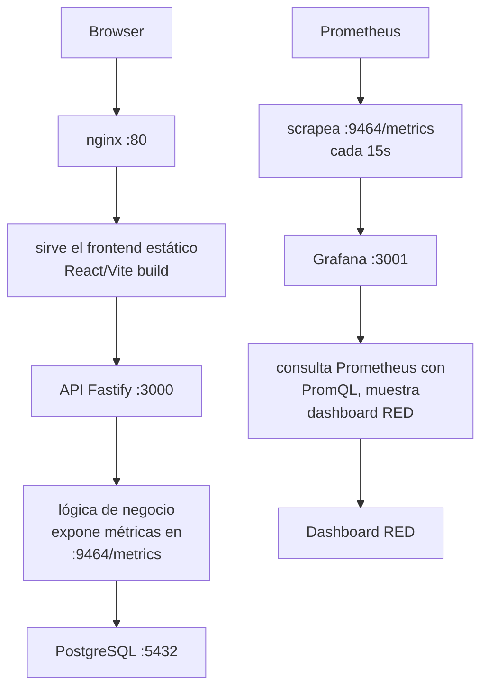

# Documentación de decisiones

## Arquitectura final



## Decisiones técnicas

#### 1. `createREDMetrics(meter)` en lugar de singletons exportados

&nbsp; El enunciado plantea una función `createREDMetrics(meter)` que retorna los instrumentos. Se siguió ese patrón en lugar de exportar los instrumentos directamente como `export const`, porque crear instrumentos con el mismo nombre más de una vez en el mismo MeterProvider genera conflictos de registro. Al llamar `createREDMetrics(meter)` una sola vez por controller (a nivel de módulo, fuera de la clase), cada controller tiene su propia instancia sin conflictos.

#### 2. No declarar `instrumentation-fastify` explícitamente

&nbsp; La versión instalada de `@opentelemetry/auto-instrumentations-node` no expone `@opentelemetry/instrumentation-fastify` como clave válida en `InstrumentationConfigMap`. Fastify queda instrumentado automáticamente por `getNodeAutoInstrumentations` sin necesidad de declararlo explícitamente.

#### 3. `req.url.split('?')[0]` para el label `route`

&nbsp; Lo correcto para evitar cardinalidad infinita en Prometheus sería `routeOptions?.url`, que devuelve el template de ruta (`/api/v1/socios/:id`) en lugar del valor real (`/api/v1/socios/123`). Sin embargo, el enunciado usa `req.url.split('?')[0]` en su ejemplo, por lo que se siguió ese criterio para mantener consistencia con lo planteado por la cátedra.

#### 4. `docker-compose.observability.yml` separado del compose principal

&nbsp; No existía ningún compose para el stack de observabilidad. Se optó por un archivo separado (`docker-compose.observability.yml`) con Prometheus y Grafana, en lugar de agregarlos al `docker-compose.prod.yml`. Esto permite levantar o bajar el stack de observabilidad de forma independiente sin afectar los servicios principales. Se usó `extra_hosts: host.docker.internal:host-gateway` para que Prometheus pueda alcanzar la API corriendo en el host desde dentro del contenedor.

## Problemas encontrados

#### Error arrastrado: error de tipeo en el enum status de Equipment Loan

**Descripción**: El sistema no levantaba debido a errores acumulados de entregas anteriores.

**Causa**: Existía un error de tipeo en el valor del enum: dEmaged en lugar de dAmaged, que estaba inconsistente en múltiples capas del stack:

| Capa                     | Archivo        |
| ------------------------ | -------------- |
| Schema (modelo de datos) | schema.ts      |
| Update Equipment Loan    | updateEL.ts    |
| Validator Equipment Loan | validatorEL.ts |
| Migración PostgreSQL     | \*.sql / seed  |

Como el error de tipeo existía en todos lados de forma "consistente", no rompía en desarrollo — pero al corregirlo en un solo lugar sin actualizar los demás, el desacuerdo entre capas hizo que el contenedor alentapp-api-1 terminara en estado unhealthy, bloqueando el arranque completo del compose:

```powershell
[+] up 20/20solving provenance for metadata file
 ✔ Image postgres:16-alpine          Pulled                                                               28.4s
 ✔ Image alentapp-api                Built                                                               133.6s
 ✔ Image alentapp-web                Built                                                               133.6s
 ✔ Network alentapp_alentapp-network Created                                                               0.2s
 ✔ Volume alentapp_pgdata            Created                                                               0.1s
 ✔ Container alentapp-db-1           Healthy                                                              12.4s
 ✘ Container alentapp-api-1          Error dependency api failed to start                                103.6s
 ✔ Container alentapp-web-1          Created                                                               0.2s
dependency failed to start: container alentapp-api-1 is unhealthy

What's next:
    Debug this Compose error with Gordon → docker ai "help me fix this compose error"
```

**Solución**: Unificar el valor correcto dAmaged en los cuatro puntos: schema, lógica de update, validador y la definición del enum en Postgres

---

#### El servidor nunca arrancaba en producción

**Descripción:** al levantar la API con `docker-compose.prod.yml`, el servidor no respondía a ningún request. Los logs no mostraban errores pero tampoco el mensaje de inicio.

**Causa:** `app.ts` tenía esta condición para arrancar el servidor:

```typescript
if (process.argv[1] && process.argv[1].endsWith('app.ts'))
```

En producción el archivo compilado es `app.js`, por lo que la condición era siempre `false` y el servidor nunca arrancaba.

**Solución:** se extendió la condición para contemplar ambos casos:

```typescript
if (process.argv[1] && (process.argv[1].endsWith('app.ts') || process.argv[1].endsWith('app.js')))
```

---

#### El cliente de Prisma no se encontraba en runtime

**Descripción:** la API arrancaba pero cualquier operación con la base de datos fallaba con un error de módulo no encontrado al intentar importar el cliente generado de Prisma.

**Causa:** el Stage 3 del `Dockerfile.prod` copiaba el cliente generado desde `src/generated` al path `src/generated` del runtime, pero el código compilado por `tsc` lo busca en `dist/generated`.

**Solución:** se corrigió el path de destino en el `COPY` del Dockerfile:

```dockerfile
# Antes
COPY --from=build /app/packages/api/src/generated ./src/generated

# Después
COPY --from=build /app/packages/api/src/generated ./dist/generated
```

---

#### Prometheus no podía alcanzar la API desde el contenedor

**Descripción:** Prometheus arrancaba correctamente pero el target `alentapp-api` aparecía como `DOWN` en la UI. Las métricas de OpenTelemetry en `:9464/metrics` no eran scrapeadas.

**Causa:** Prometheus corre dentro de un contenedor Docker y la API corre en el host (o en otro compose). Desde adentro del contenedor, `localhost` no apunta al host sino al propio contenedor, por lo que la conexión era rechazada.

**Solución:** se agregó `extra_hosts: host.docker.internal:host-gateway` en el servicio de Prometheus en `docker-compose.observability.yml`, y se actualizó `prometheus.yml` para apuntar a `host.docker.internal:9464` en lugar de `localhost:9464`.

---

#### No renderizaba la pagina por los workers del docker-compose.prod

## Dashboard RED
