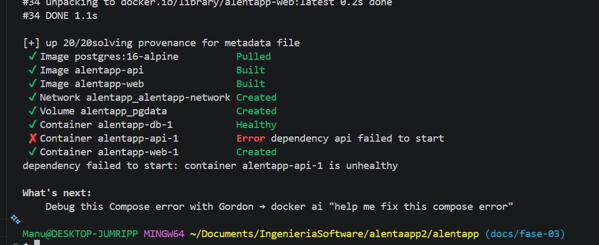

# Documentación de decisiones

## Arquitectura final

```
[Navegador]
    │
    ▼
[nginx :80]  ←── sirve el frontend estático (React/Vite build)
    │
    ▼
[API Fastify :3000]  ←── lógica de negocio
    │                ←── expone métricas en :9464/metrics
    ▼
[PostgreSQL :5432]

[Prometheus]  ←── scrapea :9464/metrics cada 15s
    │
    ▼
[Grafana :3001]  ←── consulta Prometheus con PromQL, muestra dashboard RED
```

## Decisiones técnicas

## Problemas encontrados

- no levantaba x errores pasados (dEmaged vs dAmaged: schema, updateEL, validator EL
  

## Dashboard RED
